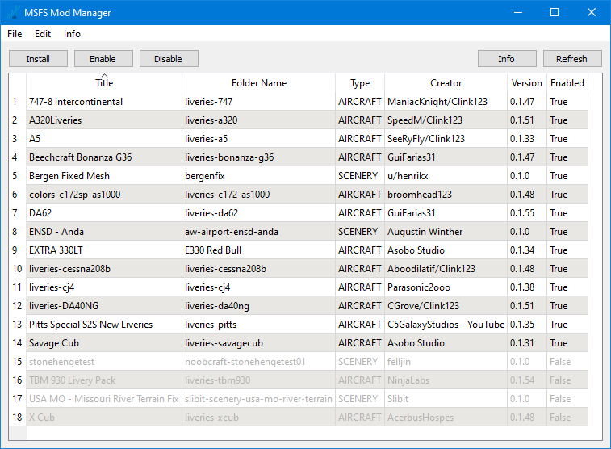
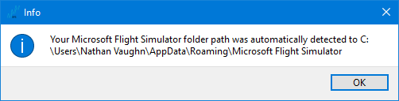
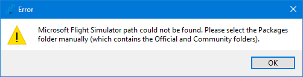
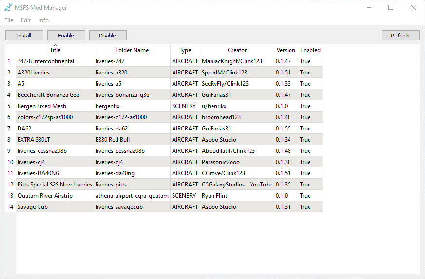
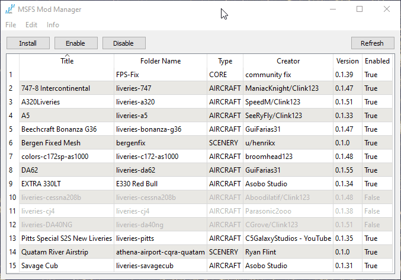
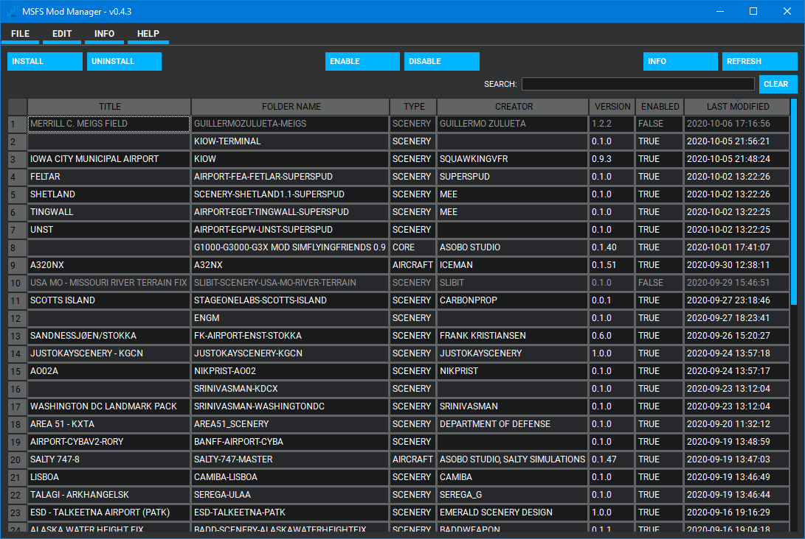
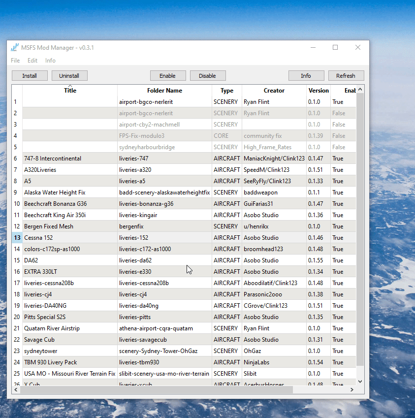

# MSFS Mod Manager


This is an external mod manager for the new Microsoft Flight Simulator.



## Features

### Automatic Installation Detection

The program automatically tries to determine where the sim is installed, for you.
No rooting around inside the `AppData` folder.



If the program can't automatically find the installation folder (you put it somewhere
non-standard), you can manually select the location that contains the `Community` and
`Official` folders.



This is normally `%USER%\AppData\Roaming\Microsoft Flight Simulator\Packages` or
`%USER%\AppData\Local\Packages\Microsoft.FlightSimulator_8wekyb3d8bbwe\LocalCache\Packages`
unless you manually selected a different location.

### Super Easy Mod Installs

The program will extract an archive, find all mods inside, and install them
inside the correct folder automatically.



### Enable and Disable Mods

Enable and disable mods on the fly without needing to re-download them.



### Matching Theme

A custom-designed theme to roughly match the MSFS UI is optionally available.



### No Need to Reinstall Anything

The program parses the native game files, so you do not need to reinstall all of your
mods to take advantages of the features of this mod manager.

### Mod Info

View info about a mod and quickly open the directory it is located in.



### Backups

Easily create backups of all of your enabled mods, in case you need to reinstall
your game.

### More To Come

This is still under active development. Pull requests welcome!

## Usage

Just head to the
[releases page](https://github.com/NathanVaughn/msfs-mod-manager/releases)
to download the latest installer. Or, if you want to live life on the edge,
run the code from source, as described below.

Note: If you want extract `.rar` or `.7z` files with the program, you'll need
to have [7zip](https://www.7-zip.org/) installed.

If Windows complains that the application is untrusted, this is because
the executable is not signed. A code signing certificate is needed to fix this,
but they are rather expensive, and I can't justify the cost.
The program is open source however, so you could build
it yourself if you wanted, and the provided pre-built binaries are all created
[automatically on GitHub's infrastructure](https://github.com/NathanVaughn/msfs-mod-manager/actions?query=workflow%3A%22Make+Release%22).

## Running/Building From Source

To run the program from source, first install [Python 3.6](https://www.python.org/downloads/release/python-368/). Python 3.7 and Python 3.8 are not fully supported yet.
Next, install the dependencies with `pipenv`:

```bash
python -m pip install pipenv
pipenv install
```

Activate the newly created virtual environment with `pipenv shell`.

To run the program, use `fbs run`.

To build the program, use `fbs freeze` and optionally `fbs installer` to create an
NSIS installer
(will need to install [NSIS](https://nsis.sourceforge.io/Main_Page) seperately).