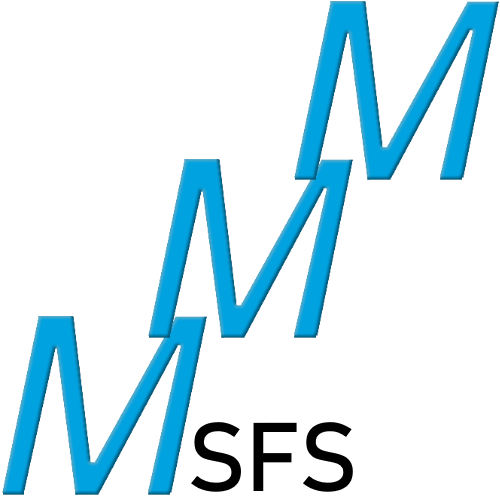

<center></center>

# MSFS Mod Manager

[](https://github.com/psf/black)
[](https://github.com/NathanVaughn/msfs-mod-manager/releases/latest)

[](https://github.com/NathanVaughn/msfs-mod-manager/stargazers)
[](https://www.codacy.com/manual/NathanVaughn/msfs-mod-manager?utm_source=github.com&amp;utm_medium=referral&amp;utm_content=NathanVaughn/msfs-mod-manager&amp;utm_campaign=Badge_Grade)
[](https://github.com/NathanVaughn/msfs-mod-manager/blob/master/LICENSE)

This is an external mod manager for the new Microsoft Flight Simulator to help you install
and manage 3rd party addons.


## Features

### Automatic Installation Detection

The program automatically tries to determine where the sim is installed, for you.
No rooting around inside the `AppData` folder.


If the program can't automatically find the installation folder (you put it somewhere
non-standard), you can manually select the location that contains the `Community` and
`Official` folders.


This is normally `%USER%\AppData\Roaming\Microsoft Flight Simulator\Packages` or
`%USER%\AppData\Local\Packages\Microsoft.FlightSimulator_8wekyb3d8bbwe\LocalCache\Packages`
unless you manually selected a different location.

### Super Easy Mod Installs

The program will extract an archive, find all mods inside, and install them
inside the correct folder automatically.


### Enable and Disable Mods

Enable and disable mods on the fly without needing to re-download them.


### Matching Theme

A custom-designed theme to roughly match the MSFS UI is optionally available.


### No Need to Reinstall Anything

The program parses the native game files, so you do not need to reinstall all of your
mods to take advantage of the features of this mod manager.

### Mod Info

View info about a mod and quickly open the directory it is located in.


### Backups

Easily create backups of all of your enabled mods, in case you need to reinstall
your game.

### Search

Filter mods as you type to help you find what you're looking for.


### More To Come

This is still under active development. Pull requests welcome!

## Usage

Just head to the
[releases page](https://github.com/NathanVaughn/msfs-mod-manager/releases)
to download the latest installer. Or, if you want to live life on the edge,
run the code from source, as described below.

Note: If you want extract `.rar` or `.7z` files with the program, you'll need
to have [7zip](https://www.7-zip.org/) installed.

If Windows complains that the application is untrusted, this is because
the executable is not signed. A code signing certificate is needed to fix this,
but they are rather expensive, and I can't justify the cost.
The program is open source however, so you could build
it yourself if you wanted, and the provided pre-built binaries are all created
[automatically on GitHub's infrastructure](https://github.com/NathanVaughn/msfs-mod-manager/actions?query=workflow%3A%22Create+Release%22).

## Running/Building From Source

### Dependencies

First, install [Python 3.9](https://www.python.org/downloads/release/python-395/).

Next, install the dependencies with `pipenv`:

```bash
python -m pip install pipenv
pipenv install
```

### Running

To actually run the program, use
```bash
pipenv run python app/main.py
```

or
```bash
pipenv shell
python app/main.py
```

### Building

Building is done with the `build.ps1` script.

To build a portable version of the program, run
```bash
./scripts/build.ps1
```

If you want a debug version of an `.exe`, add the `-debug` flag.

To build an installer version of the program, you first need to install
[NSIS](https://nsis.sourceforge.io/Main_Page).
Now, run the same build script with the `-installer` flag:
```bash
./scripts/build.ps1 -installer
```

### Creating a Release

1. Create a commit modifying the version number of `app/assets/version.txt`.
2. In this commit, add the release notes to the commit body.
3. Tag this commit with the version number in the form of `v#.#.#`.
4. Push tag and commit to origin.

## Disclaimer

This project is not affiliated with Asobo Studios or Microsoft.
I am an aerospace engineer that is working on this in my free time.
I may not be very fast in bugfixes or adding new features.

**Please do not redistribute without permission.**
