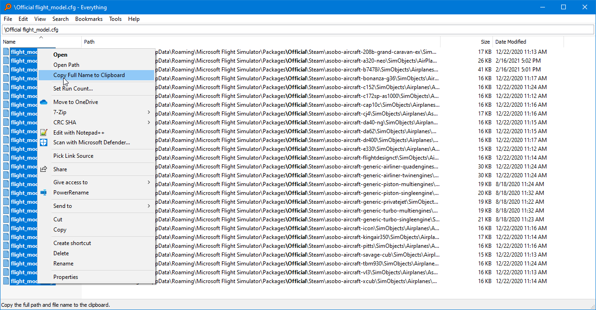

# flap_lift_fix.py

This script will help you fix the [flight dynamics bug](https://forums.flightsimulator.com/t/flight-dynamics-bug-details/368499)
introduced in World Update 3, which Asobo decided not to fix immediately.

***!!! WARNING*** Use at your our peril

## Requirements

You need the following installed:

- [Everything](https://voidtools.com/downloads/)
- [Python 3](https://www.python.org/downloads/release/python-392/) ([Microsoft Store](https://www.microsoft.com/store/productId/9P7QFQMJRFP7))

## Usage

First, download this repository. Either with [git](https://git-scm.com/download/win):

```
git clone https://github.com/NathanVaughn/msfs-mod-manager.git
```

or by downloading a `.zip` file:

[https://github.com/NathanVaughn/msfs-mod-manager/archive/master.zip](https://github.com/NathanVaughn/msfs-mod-manager/archive/master.zip)

You can also just download the one script file if you wish as well: [flap_lift_fix.py](https://raw.githubusercontent.com/NathanVaughn/msfs-mod-manager/master/scripts/flap_lift_fix.py)

Now, open up Everything, and search the phrase `\Official flight_model.cfg`.
This will find all of the flight model files for the official aircraft. Unfortunately,
this will not work for premium aircraft where the files are encrypted.

Select all the results and right-click and select "Copy Full Name to Clipboard".



Wherever you downloaded this repository, create the file `files.txt` inside the
`scripts` directory, and paste all the paths into this. Example:

```
C:\Users\Nathan Vaughn\AppData\Roaming\Microsoft Flight Simulator\Packages\Official\Steam\asobo-aircraft-208b-grand-caravan-ex\SimObjects\Airplanes\Asobo_208B_GRAND_CARAVAN_EX\flight_model.cfg
C:\Users\Nathan Vaughn\AppData\Roaming\Microsoft Flight Simulator\Packages\Official\Steam\asobo-aircraft-a320-neo\SimObjects\AirPlanes\Asobo_A320_NEO\flight_model.cfg
C:\Users\Nathan Vaughn\AppData\Roaming\Microsoft Flight Simulator\Packages\Official\Steam\asobo-aircraft-b7478i\SimObjects\Airplanes\Asobo_B747_8i\flight_model.cfg
C:\Users\Nathan Vaughn\AppData\Roaming\Microsoft Flight Simulator\Packages\Official\Steam\asobo-aircraft-bonanza-g36\SimObjects\Airplanes\Asobo_Bonanza_G36\flight_model.cfg
C:\Users\Nathan Vaughn\AppData\Roaming\Microsoft Flight Simulator\Packages\Official\Steam\asobo-aircraft-c152\SimObjects\Airplanes\Asobo_C152\flight_model.cfg
C:\Users\Nathan Vaughn\AppData\Roaming\Microsoft Flight Simulator\Packages\Official\Steam\asobo-aircraft-c172sp-as1000\SimObjects\Airplanes\Asobo_C172sp_AS1000\flight_model.cfg
...
```

Lastly, run `flap_lift_fix.py` by double-clicking on it or running:

```bash
python flap_lift_fix.py
```

from the command line.

## Note

Running this program more than once won't do anything. When it runs the first time,
it adds a comment not parsed by Flight Simulator to indicate that the file
has already been fixed. It checks for this comment before making any changes,
so running this program multiple times won't decrease your flap lift by half every time.